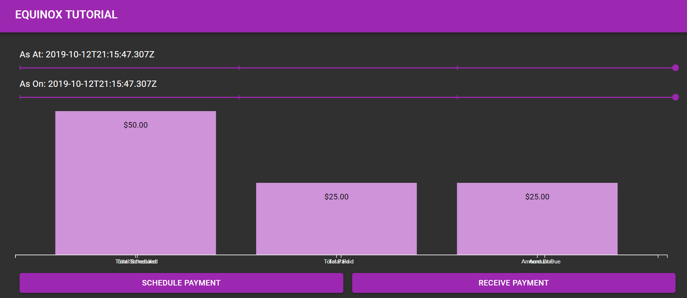
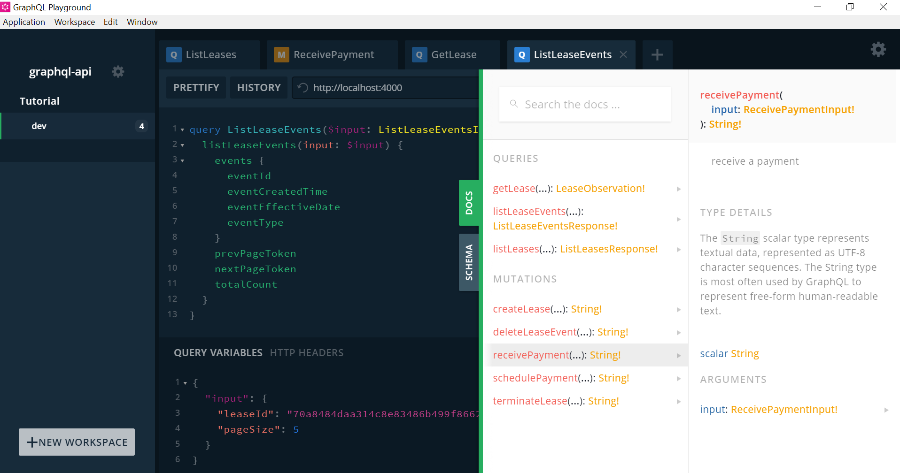
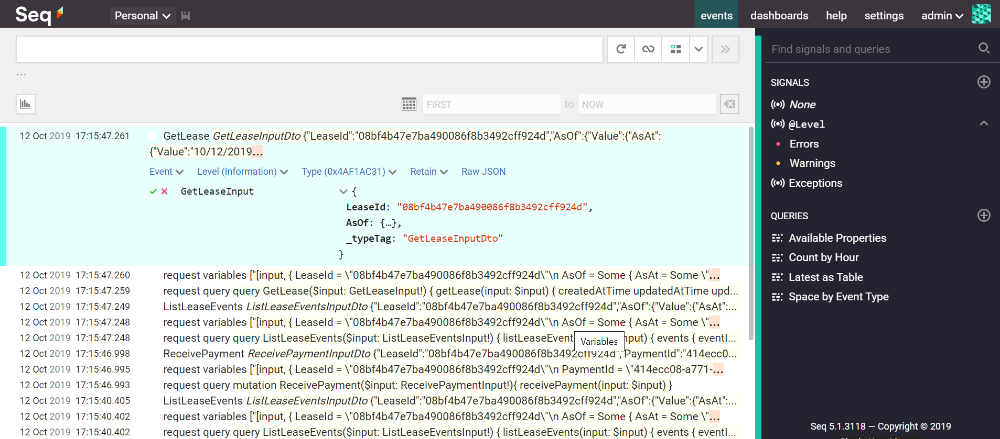
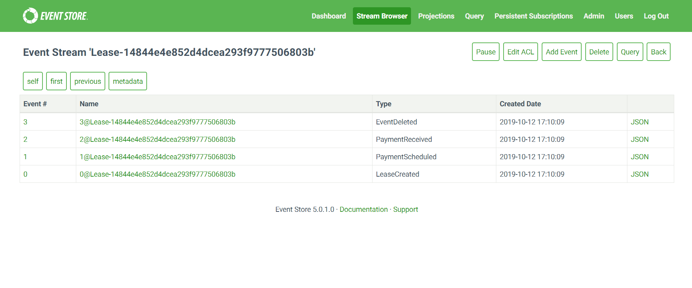
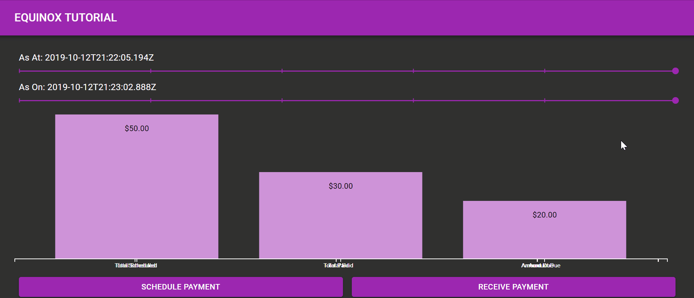

# Equinox Tutorial
[]( https://g.codefresh.io/public/accounts/ameier38/pipelines/ameier38/equinox-tutorial/equinox-tutorial)
___
Practical example for learning how to model a bi-temporal domain using
[Jet.com's Equinox Event Sourcing Platform](https://github.com/jet/equinox).

__Features__
- Bi-temporal, event sourced API in F# using 
[Jet.com's Equinox platform](https://github.com/jet/equinox) 
and [gRPC](https://grpc.io/) :milky_way:.
- Protobuf files compiled with 
[Uber's Prototool](https://github.com/uber/prototool) :wrench:.
- Fully typed GraphQL API using 
[FSharp.Data.GraphQL](https://github.com/fsprojects/FSharp.Data.GraphQL) :fireworks:.
- Centralized logging with [Seq](https://datalust.co/seq) :scroll:.
- Web application using [React](https://reactjs.org/) 
and [TypeScript](https://www.typescriptlang.org/) :computer:.
- Fully Dockerized for fast local development :whale:.
- Integration tests and example CI using [Codefresh](https://codefresh.io/) :leaves:.
- Build automation using [FAKE](https://github.com/fsharp/FAKE) :hammer:.

> The domain model is a lease, such as a car lease. 
A more detailed explanation about the motivation for modeling a bi-temporal domain 
can be found in the accompanying 
[blog post](https://andrewcmeier.com/bi-temporal-event-sourcing).

## TL;DR
```
docker-compose up -d
```
Endpoints:
- http://localhost:2113 -> Event Store UI (database; user:admin password:changeit)
- http://localhost:5341 -> Seq UI (logging)
- http://localhost:8080 -> GraphQL Playground
- http://localhost:3000 -> Web application

## Structure
```
equinox-tutorial
├── README.md           --> You are here
├── codefresh.yml       --> CI/CD
├── docker-compose.yml  --> Dockerization
├── app                 --> Web application
├── graphql-api         --> GraphQL API
├── lease-api           --> Lease gRPC API (business logic)
└── proto               --> Protobuf files
```

## Screenshots
__Application__


__GraphQL Playground__


__Seq Logs__


__Event Store__


## Time Travel

> Going back in time by changing _As At Date_ shows that only one lease existed.
Moving forward the more recently created lease can be seen again.

## Resources
- [Equinox](https://github.com/jet/equinox)
- [Event Sourcing Basics](https://eventstore.org/docs/event-sourcing-basics/index.html)
- [12 Things You Should Know About Event Sourcing](https://blog.leifbattermann.de/2017/04/21/12-things-you-should-know-about-event-sourcing/)
- [Uber Protobuf Style Guide V2](https://github.com/uber/prototool/tree/dev/style)
- [GraphQL CLI](https://github.com/graphql-cli/graphql-cli)
- [Apollo GraphQL](https://www.apollographql.com/docs/react/)
- [F# Expecto](https://github.com/haf/expecto)
