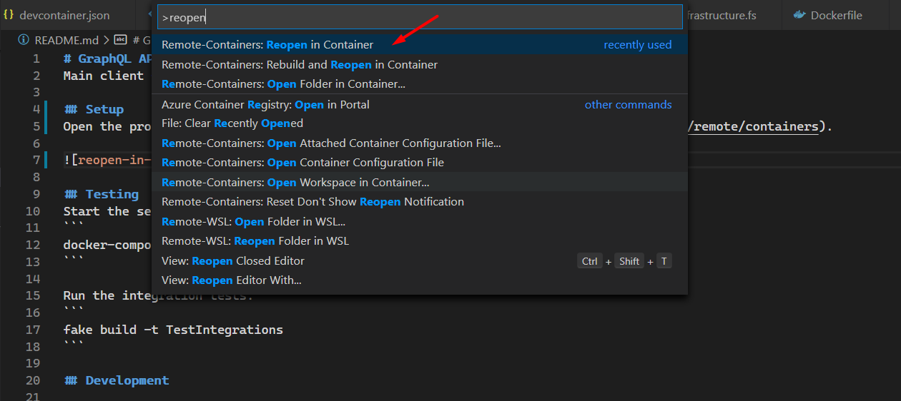

# GraphQL API
Main client facing API.

## Setup
Open the project using [VS Code Remote Containers](https://code.visualstudio.com/docs/remote/containers).



## Testing
Start the server locally for integration tests.
```
docker-compose up -d --build graphql-api
```

Run the integration tests.
```
fake build -t TestIntegrations
```

## Development

### Updating protobuf files
Update the protobuf files and generate the new outputs. 
See [proto README](../proto/README.md) for instructions.

Then copy the generated files and build the Proto project.
```
fake build -t UpdateProtos
```

### Generate test authentication key
```
echo -n test | openssl sha1 -hmac key
```
```
671f54ce0c540f78ffe1e26dcf9c2a047aea4fda
```

## Resources
- [Giraffe](https://github.com/giraffe-fsharp/Giraffe/blob/master/DOCUMENTATION.md)
- [GraphQL](https://graphql.org/)
- [GraphQL CLI](https://github.com/graphql-cli/graphql-cli)
- [F# GraphQL](https://github.com/fsprojects/FSharp.Data.GraphQL)
- [GraphQL Over HTTP](https://graphql.org/learn/serving-over-http)
- [Snowflaqe](https://github.com/Zaid-Ajaj/Snowflaqe)
- [Designing Graphql Mutations](https://blog.apollographql.com/designing-graphql-mutations-e09de826ed97)
- [GraphQL Error Handling](https://medium.com/@sachee/200-ok-error-handling-in-graphql-7ec869aec9bc)
- [System.IdentityModel.Tokens.Jwt](https://docs.microsoft.com/en-us/dotnet/api/system.identitymodel.tokens.jwt?view=azure-dotnet)
- [Validating Jwt Tokens](https://dotnetcoretutorials.com/2020/01/15/creating-and-validating-jwt-tokens-in-asp-net-core/)
- [HS256 vs. RS256](https://blog.authrocket.com/blog/2017/4/jwt-signing-hs256-vs-rs256)
- [ASP.NET Token Authentication](https://developer.okta.com/blog/2018/03/23/token-authentication-aspnetcore-complete-guide)
- [MongoDB Pagination](https://www.codementor.io/@arpitbhayani/fast-and-efficient-pagination-in-mongodb-9095flbqr)
