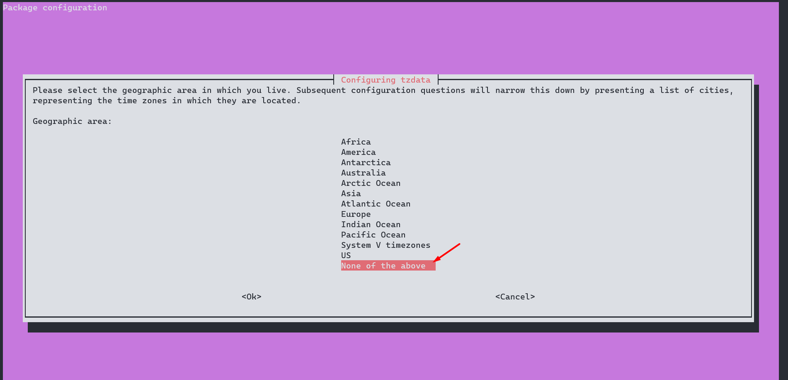
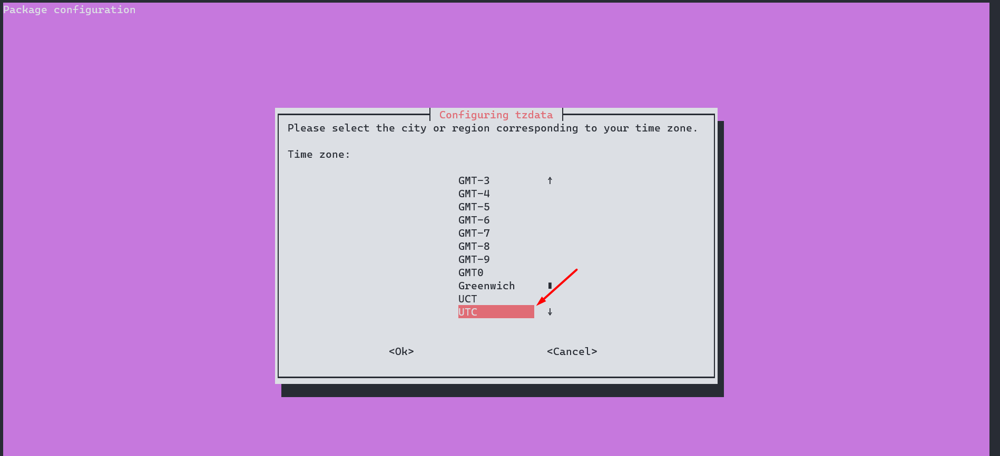

# GraphQL API
WIP

## Authentication
Authentication is performed by validating a JSON Web Token (JWT)
signed using the RS256 algorithm. This is the default algorithm
for [Auth0](../infrastructure/auth0.md) and recommended as the secret
used to sign the JWT does not have to be shared in order to verify the JWT.


## Setup
First check the timezone of your host machine. We want to make sure we
are generating test certificates using the same timezone (UTC) in which the
server will be running so we don't get errors in certificate validation.
```shell
cat /etc/timezone
```
```
America/New_York
```

If the timezone is something other than `Etc/UTC` then change the timezone.
```shell
sudo dpkg-reconfigure tzdata
```





Check the timezone.
```shell
cat /etc/timezone
```
```
Etc/UTC
```

Generate a private key to test token validation.
```shell
openssl genrsa -o private-key 2048
```

Generate a test certificate.
```shell
openssl req -new -x509 -key private-key -out client-cert -days 365
```

## Resources
- [Navigating RS256](https://auth0.com/blog/navigating-rs256-and-jwks/)
- [OpenSSL Essentials](https://www.digitalocean.com/community/tutorials/openssl-essentials-working-with-ssl-certificates-private-keys-and-csrs)
- [Create RSA Keys Using OpenSSL](https://www.scottbrady91.com/OpenSSL/Creating-RSA-Keys-using-OpenSSL)
