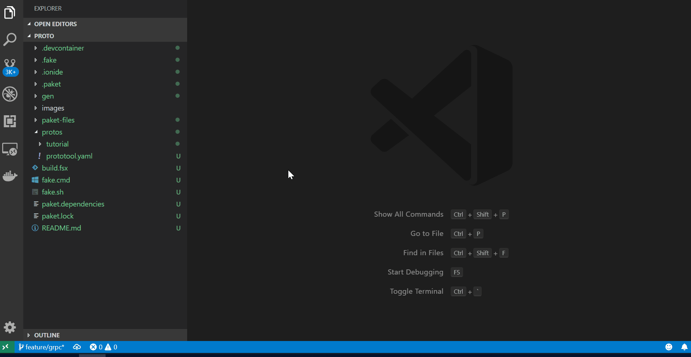

# Proto
Protobuf definitions.

## Setup
It is easiest to use the 
[VS Code Remote](https://code.visualstudio.com/docs/remote/containers)
as it provides a convient way to install all the dependencies.

First install VS Code Insiders. On Windows you can use scoop.
```
scoop install code-insiders
```

Next open the proto directory in VS Code Insiders.
```
code-insiders ./proto
```

Then type `Ctrl+Shift+p` and select 'Reopen Folder in Container'



## Usage
Create a new `.proto` file.
```
cd protos
mkdir -p tutorial/lease/v1/lease.proto
prototool create tutorial/lease/v1/lease.proto
```
> You must be in the same folder as the `prototool.yaml`
to run `prototool` commands.

Lint the proto files.
```
fake build -t Lint
```

Check that the proto files can compile.
```
fake build -t Compile
```

Generate the gRPC files.
```
fake build -t Generate
```

## Resources
- [gRPC Status Codes](https://github.com/grpc/grpc/blob/master/doc/statuscodes.md)
- [VS Code Remote Containers](https://code.visualstudio.com/docs/remote/containers)
