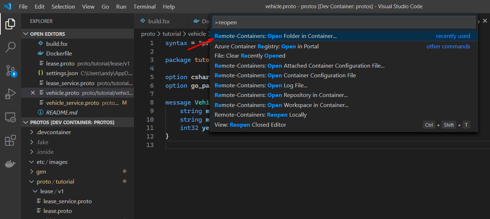

# Proto
Protobuf definitions.

## Setup
It is easiest to use VS Code with remote containers. This opens
VS Code inside a pre-configured Docker container with all the 
necessary dependencies installed.



## Usage
Create a new `.proto` file.
```
cd proto
mkdir -p tutorial/lease/v1
touch tutorial/lease/v1/lease.proto
```

Lint the proto files.
```
fake build -t Lint
```

Generate the gRPC files.
```
fake build -t Generate
```
> Generated files can be found in the `gen` directory.

## Resources
- [VS Code Remote Containers](https://code.visualstudio.com/docs/remote/containers)
- [Protocol Buffer Development Guide](https://developers.google.com/protocol-buffers/docs/overview)
- [Buf](https://buf.build)
- [Buf Style Guide](https://buf.build/docs/style-guide)