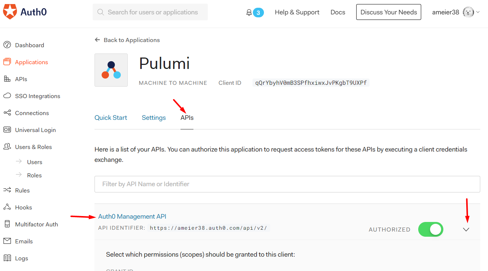

# Pulumi
Pulumi project for the Cosmic Dealership.

## Setup
### Auth0
Create a 'Machine-to-Machine' application called 'Pulumi'.


Go to the create 'Pulumi' application and navigate to the 'APIs' tab.



Scroll down to the 'Permissions' section and set the following permissions:

- `read:client_grants`, `create:client_grants`, `delete:client_grants`, `update:client_grants`
- `read:clients`, `update:clients`, `delete:clients`, `create:clients`
- `read:connections`, `update:connections`, `delete:connections`, `create:connections`
- `read:resource_servers`, `update:resource_servers`, `delete:resource_servers`, `create:resource_servers`
- `read:rules`, `update:rules`, `delete:rules`, `create:rules`
- `read:roles`, `update:roles`, `delete:roles`, `create:roles`


Go to the 'Settings' tab, copy the credentials, and set the `auth0` config.


```
pulumi config set auth0:domain <your domain>
pulumi config set auth0:clientId <your client id>
pulumi config set --secret auth0:clientSecret <your client secret>
```

### DigitalOcean
WIP

## Usage
Preview the changes.
```
pulumi preview
```

Update the resources.
```
pulumi up
```
